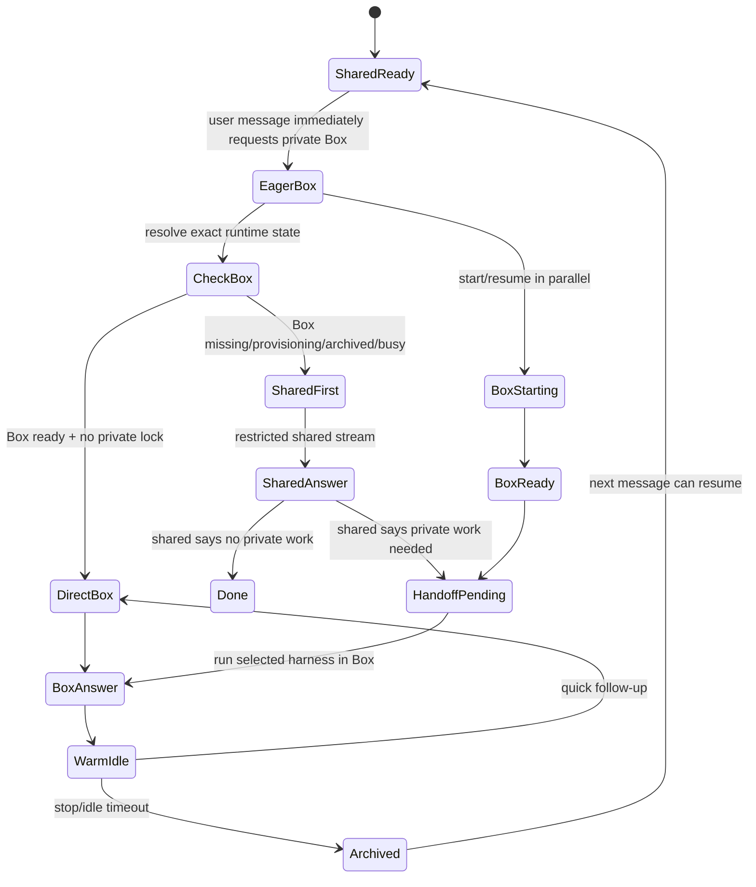

# Optibox

Optibox is a small TypeScript orchestration layer for consumer agents on Box. It gives users an instant shared response while starting or resuming their private Box, then hands off tool work to your real harness running inside that Box.

## Minimal wiring

This is the smallest complete shape used by the demos: choose a harness, pass the Box client, inject the provider keys that the harness needs inside the Box, stream visible deltas, and stop the private Box when the conversation should pause billing.

```ts
import {
  BoxHttpClient,
  ConsumerBoxAgentOrchestrator,
  InMemorySessionStore,
} from "@ascii-prototypes/consumer-box-agents";
import { providerEnvForBox } from "./examples/shared.js";
import { harness as claude } from "./examples/claude-sdk/adapter.js";

const orchestrator = new ConsumerBoxAgentOrchestrator({
  box: new BoxHttpClient({ apiKey: process.env.BOX_API_KEY! }),
  harnesses: [claude],
  sessions: new InMemorySessionStore(),
  providerEnv: providerEnvForBox(),
  sharedBoxName: "my-app-shared-prewarm",
  userBoxName: (userId) => `my-app-user-${userId}`,
  autoStopIdleMs: 60_000,
});

for await (const event of orchestrator.runTurn({
  userId: "user-1",
  conversationId: "chat-1",
  message: "Check my CPU count.",
  selection: {
    harness: "claude-agent-sdk",
    provider: "anthropic",
    model: "claude-sonnet-4-6",
  },
})) {
  if (event.type === "shared.delta" || event.type === "user-box.delta") {
    process.stdout.write(event.text);
  }
}

// When the user closes the chat or asks to pause, archive the private Box.
for await (const event of orchestrator.stopUserBox("user-1", "chat-1")) {
  if (event.type === "billing.stop") console.log("billing paused");
}
```

A harness is the developer-owned agent loop. The included adapters in `examples/*/adapter.ts` all use the same contract: the shared phase performs a restricted text-only provider call, and the user-Box phase runs the real CLI inside the private Box with provider keys injected via `providerEnv`.

## Main use case

Optibox helps you build a responsive consumer agent without keeping every user's private Box running all the time.

Simple chat can be answered immediately by a shared assistant. Requests that need private files, shell commands, or user-specific machine state are handed off to the user's Box, where your real harness runs with tools.

## Architecture

Your app provides:

- a Box API key
- one or more harness adapters
- provider API keys for the models those harnesses use
- session persistence so a user/conversation can resume the same Box

Optibox provides:

- per-user Box lifecycle management
- shared-first routing when the private Box is not ready
- direct-to-Box routing when the private Box is already warm
- transcript and handoff context
- provider environment injection for in-Box harness processes
- streaming events for UI updates, tool telemetry, lifecycle, and billing
- stop, archive, and resume handling

The shared side is restricted and fast. The Box side has the user's private runtime and runs your harness through Box commands.

## Message flow

1. The user sends a message with a selected harness/provider/model.
2. Optibox immediately requests start/resume/warm-up for that user's private Box, even for a first-turn greeting.
3. In parallel, Optibox resolves the exact Box state for route labeling and hidden context.
4. If the Box is already warm and no private lock is busy, Optibox routes directly to the selected in-Box harness.
5. If the Box is not ready, the shared assistant streams a restricted answer or bridge while the private Box boot/resume continues in parallel.
6. The shared assistant emits a hidden routing decision: continue privately, or suppress the private/tool answer if the shared answer was enough. This decision never prevents the private Box from being started for the conversation.
7. When private work is needed and the Box is ready, the harness receives the hidden conversation context, machine state, and any shared text already shown to the user.
8. The harness runs inside the Box with provider keys and tools, streams `user-box.delta` output, and may emit tool telemetry.
9. After the turn, Optibox can keep the Box briefly warm for follow-ups, then stop/archive it to pause billing.

## State machine



## Running the repo

```bash
npm install
npm test
```
