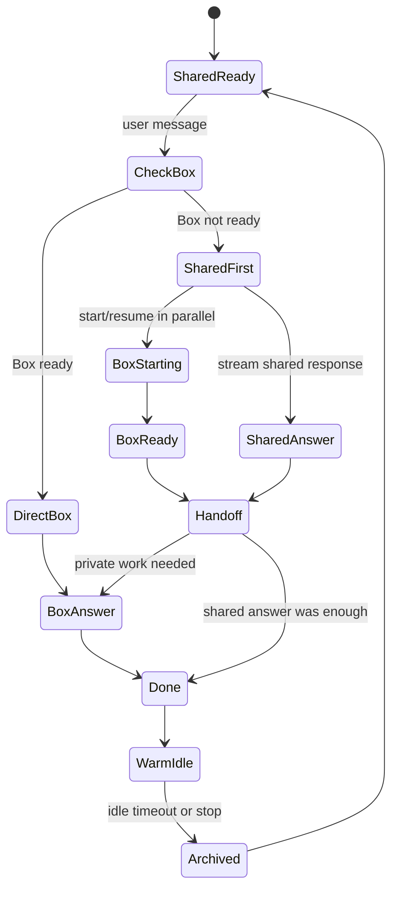

# Optibox

```ts
import {
  BoxHttpClient,
  ConsumerBoxAgentOrchestrator,
} from "@ascii-prototypes/consumer-box-agents";
import { realCliHarness } from "./examples/shared.js";

const harness = realCliHarness({
  name: "my-agent",
  bin: "my-agent",
  models: [{ provider: "anthropic", model: "claude-sonnet-4-6" }],
  buildArgv: ({ prompt, model }) => ["my-agent", "--model", model, prompt],
});

const orchestrator = new ConsumerBoxAgentOrchestrator({
  box: new BoxHttpClient({ apiKey: process.env.BOX_API_KEY! }),
  harnesses: [harness],
  providerEnv: { ANTHROPIC_API_KEY: process.env.ANTHROPIC_API_KEY! },
});

for await (const event of orchestrator.runTurn({
  userId: "user-1",
  conversationId: "chat-1",
  message: "What is my CPU count?",
  selection: {
    harness: "my-agent",
    provider: "anthropic",
    model: "claude-sonnet-4-6",
  },
})) {
  if (event.type === "shared.delta" || event.type === "user-box.delta") {
    process.stdout.write(event.text);
  }
}
```

## Main use case

Optibox helps you build a responsive consumer agent without keeping every user's private Box running all the time.

Simple chat can be answered immediately by a shared assistant. Requests that need private files, shell commands, or user-specific machine state are handed off to the user's Box, where your real harness runs with tools.

## Architecture

Your app provides:

- a Box API key
- one or more harness adapters
- provider API keys for the models those harnesses use

Optibox provides:

- per-user Box lifecycle management
- shared-first routing when the private Box is not ready
- transcript and handoff context
- streaming events for UI updates
- stop, archive, and resume handling

The shared side is restricted and fast. The Box side has the user's private runtime and runs your harness through Box commands.

## Message flow

1. The user sends a message.
2. Optibox checks the user's Box state.
3. If the Box is warm, the message can go directly to the Box harness.
4. If the Box is not ready, the shared assistant responds first while Optibox starts or resumes the Box.
5. When the Box is ready, the Box harness receives the conversation history plus any shared response.
6. The Box harness answers, adds useful private information, or stays silent if the shared answer already handled the request.
7. After the turn, the Box can stay warm briefly and then archive to stop billing.

## State machine



## Running the repo

```bash
npm install
npm test
```
