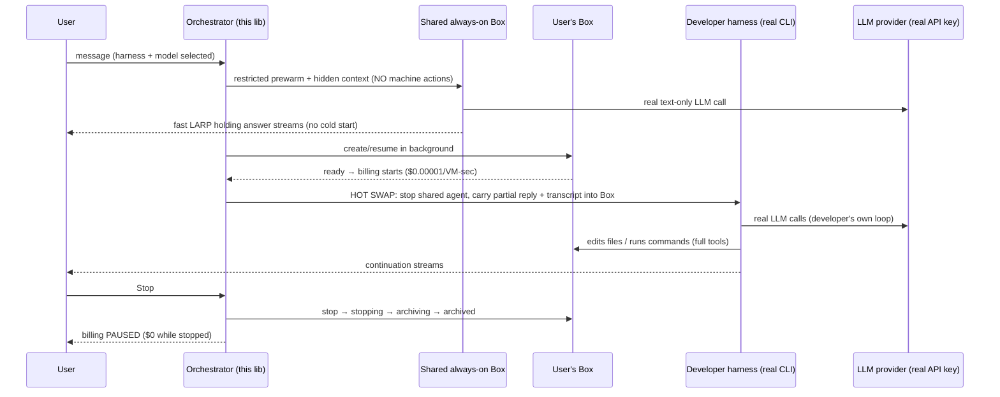

# Consumer Agents on Box — prototype

A small TypeScript framework for building **consumer agent products** where the
acting agents are the **developer's own external harnesses** (Claude Code, Codex,
OpenCode, Pi, Hermes, OpenClaude, …) and [Box](https://box.ascii.dev) is only the
**runtime substrate**.

The framework orchestrates lifecycle; it never runs Box's built-in agent.



## What's real here

- **Box is substrate, not agent.** The client is wrapped in `assertNoBoxAgent`,
  which throws if anything tries to call Box's built-in `prompt`/`events` agent.
  The framework only uses `create/get/update/stop/resume/command/readFile/writeFile`.
- **Real external harnesses.** `UserBoxCapabilities.runHarness({ argv })` launches
  the developer's real CLI/daemon **inside the user Box** (`claude`, `codex`, `opencode`,
  Pi, Hermes, or a checked-out codebase daemon) and streams its stdout. Codex and Claude Code are preinstalled in every Box;
  others are `npm i -g`'d on demand. The trace emits `runtime.proof` with
  `boxPromptApiUsed=false`, `boxBuiltInAgentUsed=false`, and
  `hostAsciiAgentUsed=false`.
- **Real LLM calls.** Harnesses call their provider with the developer's API key,
  injected into the Box env (`providerEnv`). The restricted shared answer is a
  real text-only provider call (`src/providerClient.ts`).
- **Live switching.** Harness and model are chosen **per turn**. The same Box and
  the same running transcript are reused across switches, so you can change harness
  or model mid-conversation with no disruption.
- **Restricted shared mode.** The shared adapter only ever receives
  `SafeSharedCapabilities` — `readFile/writeFile/bash/controlComputer` all throw.
  Structural guarantee, independent of what the harness attempts.
- **Context can't be lost.** Every agent (shared and user-box) is handed a hidden
  `<consumer-context>` XML envelope (`src/context.ts`) carrying the full prior
  transcript + machine/tool state + any partial shared reply. A fresh agent on a
  new machine restores the whole conversation; the host UI strips the envelope so
  the user never sees it. The agent always knows whether it has tools
  (`machine.tools`) or is still on the no-tools shared box.
- **Immediate bridge, then private answer.** If a user asks for tool work while the
  private environment is still starting, the host emits a real restricted shared
  model reply immediately under hidden/system guidance, never exposes
  Box/resume lifecycle internals, bills the private Box only once ready, and then
  continues the latest request inside the Box with full transcript/recap/tools.
- **Billing visibility.** Box bills $20 / 2,000,000 VM-sec = **$0.00001/VM-sec**,
  per second, and **pauses on stop**. `billing.start`/`billing.stop` events expose
  the rate, live cumulative cost, and the exact moment billing hits $0. The shared
  always-on box is platform-amortized across users → no cold start, **<$1/month**
  per consumer of active box time.

## Plug in your harness (only a Box API key required)

```ts
import { BoxHttpClient, assertNoBoxAgent, ConsumerBoxAgentOrchestrator } from "@ascii-prototypes/consumer-box-agents";
import { realCliHarness } from "./examples/shared.js";

const myHarness = realCliHarness({
  name: "my-harness",
  description: "my CLI agent",
  bin: "my-cli",
  installCmd: "npm i -g my-cli",          // optional; skipped if already present
  models: [{ provider: "anthropic", model: "claude-sonnet-4-6" }],
  buildArgv: ({ prompt, model }) => ["my-cli", "-p", prompt, "--model", model],
});

const orchestrator = new ConsumerBoxAgentOrchestrator({
  box: assertNoBoxAgent(new BoxHttpClient({ apiKey: process.env.BOX_API_KEY! })),
  harnesses: [myHarness],
  providerEnv: { ANTHROPIC_API_KEY: process.env.ANTHROPIC_API_KEY! }, // injected into the Box
});

for await (const ev of orchestrator.runTurn({
  userId: "u1", conversationId: "c1", message: "Fix my tests",
  selection: { harness: "my-harness", provider: "anthropic", model: "claude-sonnet-4-6" },
})) {
  // ev: shared.delta | shared.larp | context.injected | billing.start | lifecycle
  //   | handoff.started | exec | user-box.delta | turn.done
}

// Stop streams the lifecycle and the moment billing pauses:
for await (const ev of orchestrator.stopUserBox("u1", "c1")) {
  // ev: lifecycle (stopping -> archiving -> archived) | billing.stop
}
```

## Examples (one per harness)

| Folder | Harness | Status |
| --- | --- | --- |
| `examples/claude-sdk` | Claude Code / Claude Agent SDK | native token streaming via `stream-json` + partial messages |
| `examples/codebase-daemon` | Checked-out codebase daemon | stdout chunk streaming; token-level if the daemon flushes tokens |
| `examples/codex-sdk` | OpenAI Codex CLI / SDK | JSON final/delta events where exposed |
| `examples/opencode` | OpenCode (multi-provider) | JSON text/tool events from `opencode run --format json` |
| `examples/pi` | Pi coding-agent | supported; strict token streaming requires Pi RPC/AgentSession wiring |
| `examples/hermes` | Hermes / Nous via OpenCode+OpenRouter | supported; direct Hermes schema still treated as stdout/OpenCode chunks |
| `examples/openclaude` | OpenClaude | best-effort |

All listed adapters use the identical `realCliHarness` contract — that's the point: the
framework treats every harness the same.


## Runtime streaming feasibility

The demo exposes this same matrix through `/api/harnesses` and the right-side UI panel.

| Required runtime | Harness | True live stream? | Exact blocker / limitation |
| --- | --- | --- | --- |
| Claude SDK / Claude Code | `claude-agent-sdk` | Yes — native token deltas | Uses `claude -p --output-format stream-json --include-partial-messages --verbose`. |
| Checked-out codebase daemon | `codebase-daemon` | Yes for stdout chunks | Token-level only if the product daemon flushes token chunks; otherwise chunks are whatever the daemon emits. |
| Pi | `pi` | Possible via RPC / AgentSession | The current simple adapter must be upgraded to Pi RPC stdin/stdout for strict token events; simple JSON CLI can collapse updates. |
| Hermès / Hermes | `hermes` | Possible as CLI/OpenCode chunks | Direct Hermes token-event schema is not stabilized here; Hermes via OpenCode inherits OpenCode JSON event granularity. |
| OpenCode | `opencode` | Yes as native JSON text/tool events | `opencode run --format json` emits raw JSON events, but not guaranteed one event per provider token. |

## Required secrets

Provide the LLM API key(s) for the providers you select (injected into the Box and
used for the shared answer):

- `ANTHROPIC_API_KEY` — Claude Code / OpenCode (anthropic) / Pi (anthropic)
- `OPENAI_API_KEY_SCOPED` (a standard `sk-…` with model+responses scope) — Codex / OpenCode (openai)

The ChatGPT-login `OPENAI_API_KEY` JWT present in some environments lacks API
scopes and cannot drive the harnesses.

## Run

```bash
npm test                 # unit tests: restriction, no-box-agent, switching, lifecycle
npm run test:real-box    # real Box smoke (needs BOX_API_KEY)
npm run demo:real-e2e    # headless real E2E: 2 turns, harness switch, same Box
npm run proof:interactive # interactive web surface (drive it live)
```

## Docs studied

- Box product: https://box.ascii.dev
- API v1: https://docs.ascii.dev/box/api/v1.md · TS SDK: https://docs.ascii.dev/box/sdks/typescript.md
