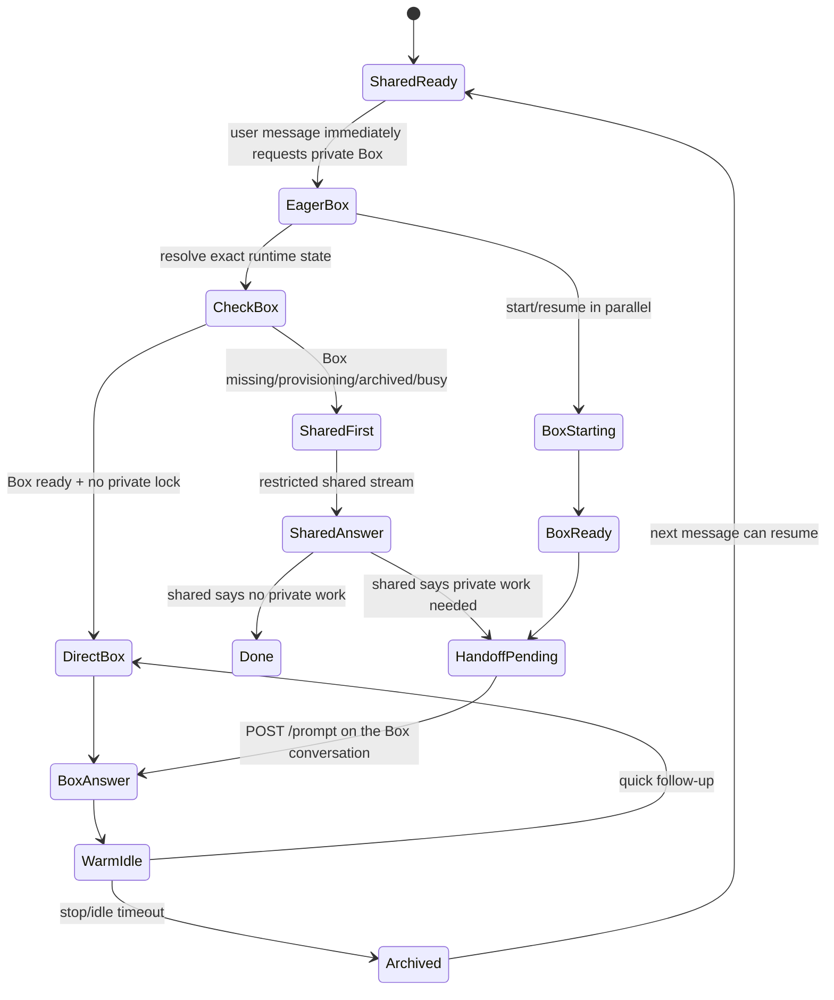

# Optibox

Optibox is a small TypeScript orchestration layer for consumer agents on Box. It gives users an instant shared response while starting or resuming their private Box, then hands the work to the agents that ship inside that Box.

## Minimal wiring

Pick a Box API key, the provider keys your users' agents run on, and a model for the shared bridge. The private side needs nothing else: every Box comes with Claude Code, Codex, pi, OpenCode and Prime Agent installed, and Box keeps each conversation's memory itself.

```ts
import { BoxHttpClient, Engine, openDb } from "@ascii-prototypes/consumer-box-agents";

const engine = new Engine({
  db: await openDb(process.env.DATABASE_URL!),
  box: new BoxHttpClient({ apiKey: process.env.BOX_API_KEY! }),
  instanceId: "my-app",
  credHash: "server",
  providerEnv: { ANTHROPIC_API_KEY: process.env.ANTHROPIC_API_KEY! }, // lands in the user's Box, nothing else does
  sharedModel: "anthropic/claude-haiku-4-5",                            // the instant no-tools answer
  autoStopIdleMs: 15_000,
});

for await (const event of engine.runTurn({
  userId: "user-1",
  conversationId: "chat-1",
  message: "Check my CPU count.",
  selection: { harness: "claude-code", provider: "anthropic", model: "claude-sonnet-5", reasoningEffort: "medium" },
})) {
  if (event.type === "shared.delta" || event.type === "user-box.delta") process.stdout.write(event.text);
}

// When the user closes the chat or asks to pause, archive the private Box.
for await (const event of engine.stopUserBox("user-1", "chat-1")) {
  if (event.type === "billing.stop") console.log("billing paused");
}
```

`selection.harness` is a Box provider id (`claude-code`, `codex`, `pi`, `opencode`, `prime-agent`); models and reasoning levels come from `GET /api/provider-models`, which the demo server exposes as `/api/harnesses`. A user can switch harness or model on any message: the conversation continues with its memory.

## What Box does for you

| Job | Box |
|---|---|
| Install and update the agents on every machine | Preinstalled; nothing to build or warm-cycle |
| Spawn the agent with the prompt, in the right directory, with the right keys | `POST /boxes/{id}/prompt` |
| Capture its output, parse tool calls, stream to the UI | `GET /boxes/{id}/events` (text, tool calls, results) |
| Remember the session so the next message continues the thread | A Box **conversation**: `new: true` once, then `conversationId` |
| Explore two directions at once without sessions colliding | Parallel conversations on the same Box (`scenariosEnabled`) |
| Stop the right process | `POST /boxes/{id}/interrupt?conversation=` |
| Keep the memory across stop / resume | Conversations ride the snapshot |
| Give every user their own keys | `POST /boxes {noEnv: true, env: {...}}` |

## Handing a machine to someone who is not you

Every box this layer creates passes `noEnv` and its own `env`: the account owner's env vars, secret files and credentials never reach the machine; only the keys in `providerEnv` do. The box keeps its own scoped token, so `host` and the desktop still work.

## The six rules

1. Always answer something: the shared bridge streams immediately, a full answer or a short holding line (its choice).
2. The private agent answers on top, with the shared text handed to it.
3. The shared agent never claims it cannot act: the private machine will.
4. The machine stops after the idle window; any activity resets it; hosting keeps it up.
5. A warm, responsive machine is routed to directly: no bridge text.
6. The private agent declines with exactly `<end>`; no text and no `<end>` is a loud `turn.blocked`.

## Architecture

Your app provides a Box API key, provider keys, and Postgres. Optibox provides per-user Box lifecycle, shared-first routing, the standing rules every harness reads (`AGENTS.md` / `CLAUDE.md`, written once per machine), transcript and hidden context, streaming events for the UI, billing, holds, hosting detection, stop and resume.


```mermaid
stateDiagram-v2
  [*] --> SharedReady
  SharedReady --> EagerBox: user message immediately requests private Box
  EagerBox --> CheckBox: resolve exact runtime state
  CheckBox --> DirectBox: Box ready + no private lock
  CheckBox --> SharedFirst: Box missing/provisioning/archived/busy
  SharedFirst --> SharedAnswer: restricted shared stream
  EagerBox --> BoxStarting: start/resume in parallel
  SharedAnswer --> Done: shared says no private work
  SharedAnswer --> HandoffPending: shared says private work needed
  BoxStarting --> BoxReady
  BoxReady --> HandoffPending
  DirectBox --> BoxAnswer
  HandoffPending --> BoxAnswer: POST /prompt on the Box conversation
  BoxAnswer --> WarmIdle
  WarmIdle --> Archived: stop/idle timeout
  Archived --> SharedReady: next message can resume
  WarmIdle --> DirectBox: quick follow-up
```

## Running the repo

```bash
npm install
npm test
```
