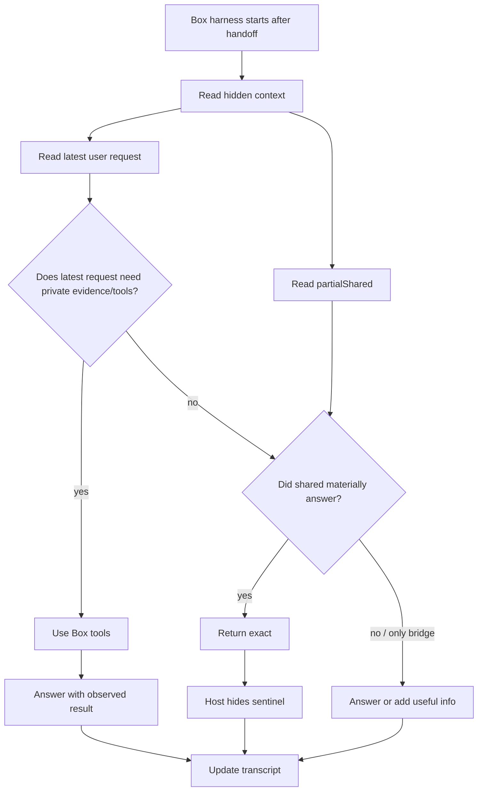
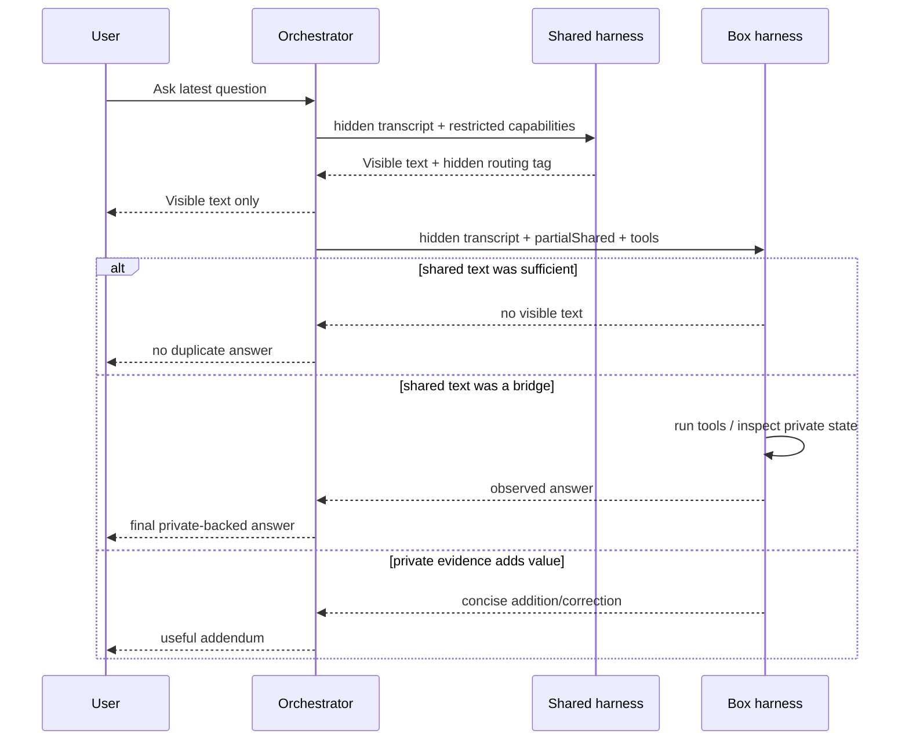
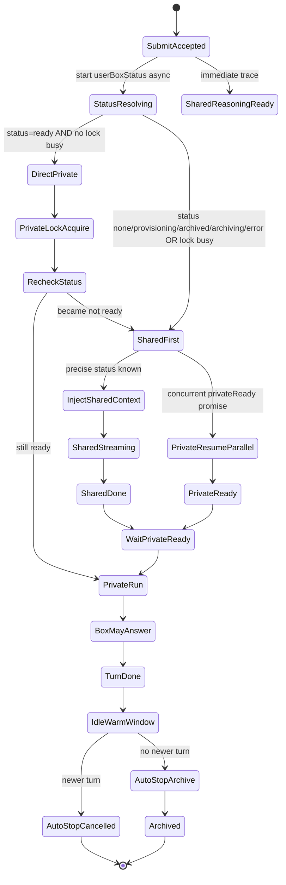
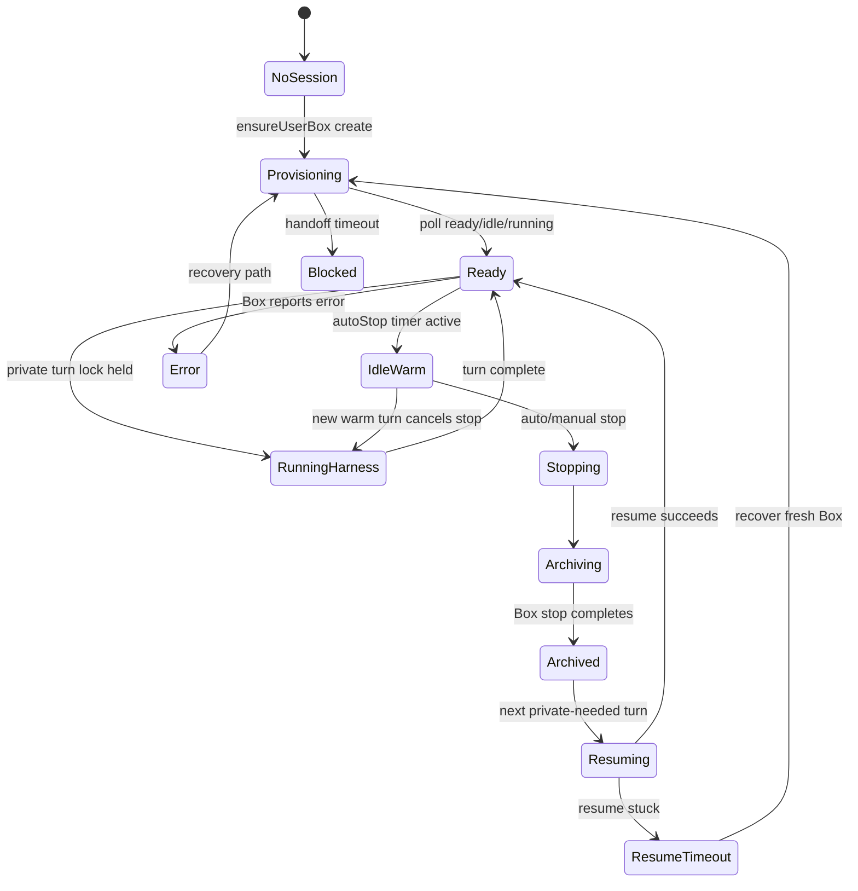
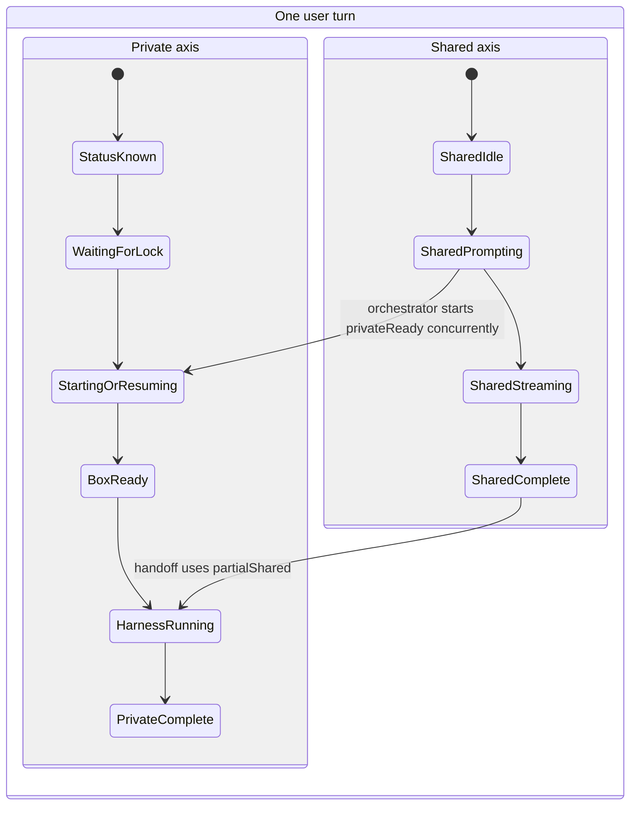
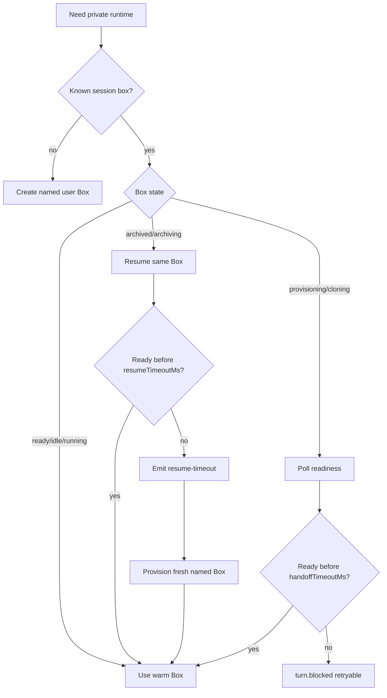
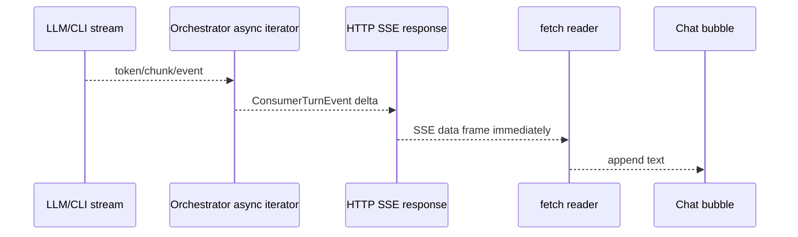
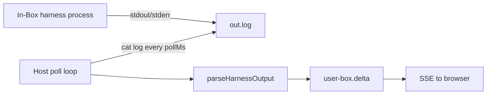
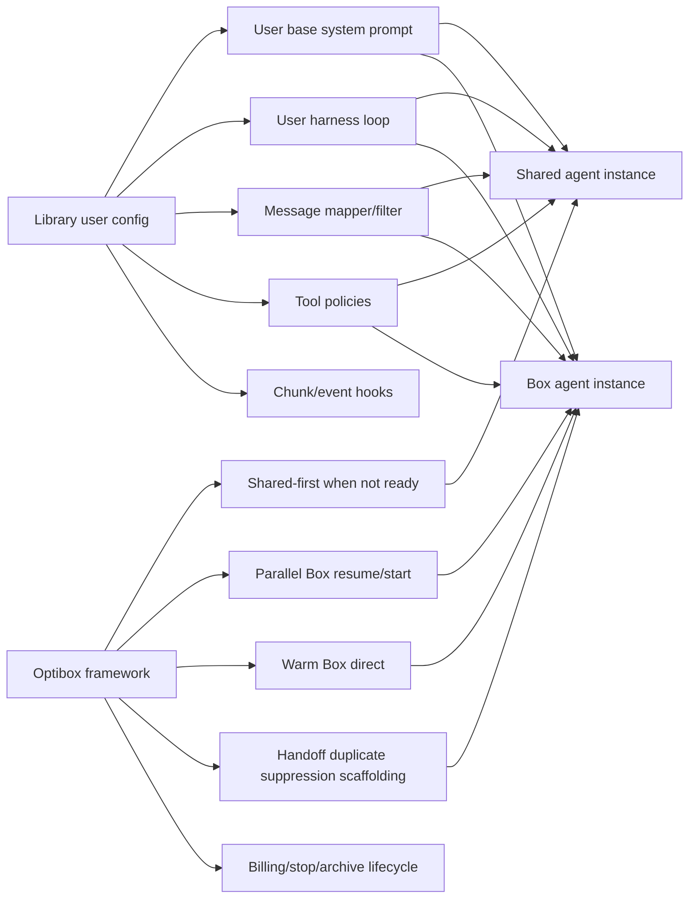
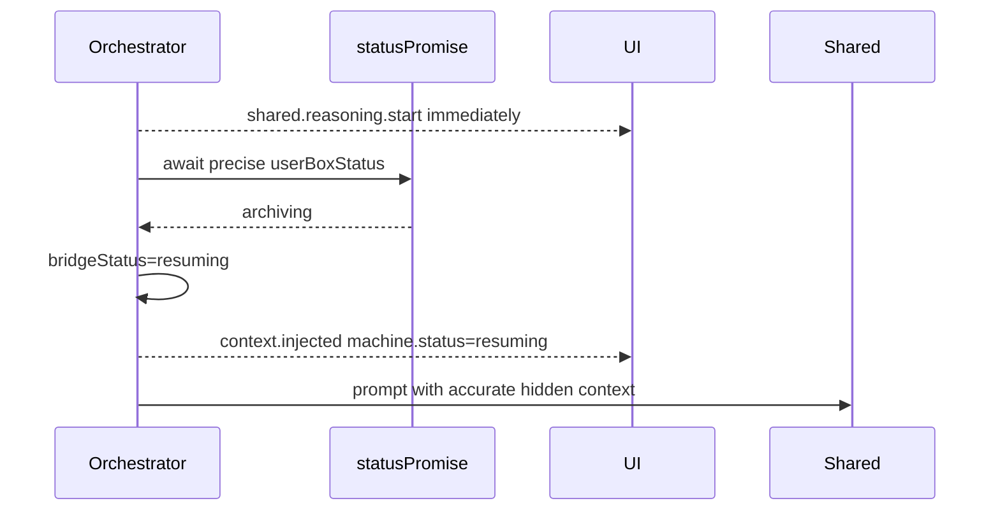

# Optibox Shared-First / Box Handoff Technical Report

Date: 2026-06-06  
Scope: Optibox demo/library code in this repository, especially `src/orchestrator.ts`, `examples/shared.ts`, `src/providerClient.ts`, `src/capabilities.ts`, `src/types.ts`, `src/runtimeMatrix.ts`, and `scripts/interactive-proof-server.ts`.

## Executive summary

Optibox now handles the archived/archiving/not-ready Box case as a **state-dependent shared-first + parallel private-resume** turn:

1. A user message is accepted immediately and the UI receives a trace event.
2. If the private Box is not immediately warm/ready, or if a private lock is busy because a stop/archive/turn is in progress, the shared assistant responds first.
3. In parallel, the orchestrator starts/resumes/recovers the private Box behind the per-conversation private lock.
4. The Box harness receives hidden history that includes the visible shared response and is instructed to either complete the task, add useful private evidence, or suppress itself if the shared answer already handled the request.
5. If the Box is already warm and not locked, the orchestrator skips the shared bridge and routes directly to the private runtime.

During this report pass I found and corrected one mismatch: the shared hidden machine context was being created before the precise Box status resolved, so an archiving/resume case could be described internally as `provisioning`. The orchestrator now waits for precise status before injecting shared hidden machine state while still emitting an immediate `shared.reasoning.start` trace. The regression test now asserts the CPU-during-archiving shared context says `resuming`.

## Grounding in current code

| Area | Current implementation |
|---|---|
| Main orchestration | `ConsumerBoxAgentOrchestrator.runTurn()` and `runAdaptiveTurn()` in `src/orchestrator.ts` |
| Shared restricted surface | `createRestrictedSharedCapabilities()` in `src/capabilities.ts`; `HarnessAdapter.shared(ctx)` in `src/types.ts` |
| Box/private surface | `createUserBoxCapabilities()` and `UserBoxCapabilities.runHarness()` in `src/capabilities.ts`; `HarnessAdapter.userBox(ctx)` in `src/types.ts` |
| Default real CLI adapter | `realCliHarness()` in `examples/shared.ts` |
| Shared LLM streaming | `streamSharedAnswer()` in `src/providerClient.ts` |
| Demo UI SSE | `sse()`, `/api/send`, and browser `drain()`/`handle()` in `scripts/interactive-proof-server.ts` |
| Runtime streaming matrix | `RUNTIME_FEASIBILITY` in `src/runtimeMatrix.ts` |

## How the Box decides to answer, add, or suppress

The duplicate-avoidance decision is currently **agentic and prompt-mediated**, not a deterministic semantic comparator in the framework.

### Data passed to the Box

When the private runtime starts, `runPrivateRuntime()` builds a user-box hidden context that includes:

- prior transcript,
- current machine state (`location="user-box"`, `tools="true"`, `boxId`),
- a recap,
- the latest user request,
- `partialShared`, the visible shared text already streamed to the user.

`examples/shared.ts` then builds Box-side instructions with this key rule:

> If a shared assistant already sent visible text and it was only a brief bridge, complete the latest request. If it already materially answered the request and no tool/private evidence is needed, do not duplicate it; output exactly `<end>` to produce no additional user-visible text. If the hidden context marks the turn with `<stale-duplicate-request>`, treat it as a queued duplicate and output exactly `<end>` unless the latest request clearly asks for new work.

Because the user explicitly wanted the shared assistant to sometimes fully answer and sometimes bridge, the system does not force every shared response into fixed bridge text. The shared side can answer general/contextual requests fully. The Box side receives that shared response and should stay silent if further private evidence is unnecessary.

### Decision table

| Shared visible response | User request needs private tools? | Box behavior intended by prompt | Example |
|---|---:|---|---|
| Brief bridge | Yes | Run tools and answer | “what's your CPU count” while Box archived → shared: “I’m checking…” → Box runs `nproc` and reports count |
| Full answer | No | Return `<end>` | “what can you do?” while Box cold → shared fully explains capabilities → Box returns `<end>` so no private text is surfaced |
| Full answer but stale/uncertain | Maybe | Add only useful correction/evidence | Shared gives general answer; Box later sees private repo facts and adds a concise correction |
| Duplicate queued request already answered by Box | No | Return `<end>` | Same request is queued twice → first Box round answers → second sees `<stale-duplicate-request>` and declines |
| Bridge plus partial details | Yes | Complete the missing tool-backed part | Shared says “I’ll look that up”; Box executes commands and reports result |

### Diagram: answer/add/suppress decision



### Current limit

This is intentionally flexible but not mathematically guaranteed. The framework structurally prevents duplicate concurrent private turns with locks, but duplicate semantic content is controlled by the harness prompt/loop. A future API should expose an optional structured handoff decision hook such as `shouldContinueAfterShared()` or require structured shared output so the framework can enforce suppression more deterministically.

## How duplicate answers are avoided without forcing useless bridges

Two mechanisms work together:

1. **Shared answer/bridge instructions** (`buildSharedSystem(ctx)`): the shared assistant decides whether it can answer completely. If it can, it answers normally. If private machine state/tool work is required, it emits a short natural bridge and a hidden `<shared-routing>{"needsPrivate":true}</shared-routing>` tag.
2. **Parallel Box handoff** (`runAdaptiveTurn()`): in a not-ready/private-lock-busy state the framework still starts or resumes the Box in parallel even if the shared text looks complete. This is deliberate for the requested architecture: the private runtime should later read the shared answer and decide whether to add or stay silent.
3. **Box handoff instructions** (`buildUserBoxInstructions(ctx)`): the Box harness is told to inspect `partialShared`; complete if it was a bridge, return exactly `<end>` if the shared response materially handled the latest request, or add only useful information.
4. **Duplicate private-answer marker** (`<stale-duplicate-request>`): once a private runtime has emitted an answer for a normalized user request, a later queued private round for the same request receives this hidden marker. The host still hands off to the Box agent; the agent itself can safely decline the stale duplicate by returning exactly `<end>`.

The user-visible control tag is stripped by `visibleSharedText()`/`stripSharedControl()` before the UI sees it. The not-ready path does not use `needsPrivate=false` to skip Box startup because that would reintroduce the possibility that the private runtime never reads the handoff history. A future structured handoff API should make this explicit instead of leaving `needsPrivate` as mostly advisory.



## Full state machine

### Top-level turn routing



### Private Box lifecycle state machine



### Concurrent/superposed states

Optibox has two partially independent state axes during not-ready turns: the shared response stream and the private Box lifecycle. They are intentionally overlapped.



### Warm Box direct response

```mermaid
sequenceDiagram
    participant UI as Browser UI
    participant O as Orchestrator
    participant Box as User Box
    participant H as In-Box harness
    UI->>O: /api/send message
    O-->>UI: trace turn.submit.accepted
    O-->>UI: trace shared.reasoning.start
    O->>O: userBoxStatus = ready, lock not busy
    O->>O: acquire private lock and recheck status
    O-->>UI: shared.larp note: skipping shared bridge
    O->>Box: extend TTL / mark billing
    O->>H: run real harness in Box
    H-->>O: streamed user-box.delta chunks
    O-->>UI: assistant · user machine chunks
    O-->>UI: turn.done
```

There is no unnecessary shared bridge in the warm path. The shared trace may exist for audit/diagnostics, but no user-visible `shared.delta` is emitted.

### Cold / never-started Box

```mermaid
sequenceDiagram
    participant U as User
    participant UI as Browser UI
    participant O as Orchestrator
    participant S as Shared assistant
    participant Box as Box API
    participant H as In-Box harness
    U->>UI: asks task needing tools
    UI->>O: /api/send
    O-->>UI: turn.submit.accepted
    O->>O: status=none
    par shared response
      O->>S: restricted ctx, machine.status=provisioning
      S-->>O: short bridge chunks + hidden routing
      O-->>UI: shared.delta chunks
    and private boot
      O->>Box: create user Box
      Box-->>O: provisioning/ready
    end
    O->>H: run harness with partialShared bridge
    H-->>O: private answer chunks
    O-->>UI: user-box.delta chunks
```

### Archived/archiving CPU-count bug reproduction path

```mermaid
sequenceDiagram
    participant U as User
    participant UI as Browser UI
    participant O as Orchestrator
    participant S as Shared assistant
    participant Box as Box API
    participant H as Private harness
    UI->>O: stopUserBox
    O->>Box: stop
    Box-->>O: archiving
    U->>UI: "what's your CPU count"
    UI->>O: /api/send while archiving/private lock busy
    O-->>UI: trace: private runtime busy/stopping; shared first
    O->>O: resolve status=archiving
    par shared first
      O->>S: machine.status=resuming, tools=false
      S-->>O: bridge chunks
      O-->>UI: shared assistant responds immediately
    and private resume behind lock
      O->>O: wait stop lock
      O->>Box: resume archived Box
      Box-->>O: ready
    end
    O->>H: hidden context includes shared bridge
    H->>Box: run nproc or lscpu
    Box-->>H: observed CPU count
    H-->>O: "4 CPUs." or equivalent
    O-->>UI: user-box.delta final result
```

Validated visible run before this report:

- User/conv: `qa-archive-1780771213` / `visible-cpu`
- Box: `bx_mseswb6q`
- Submit while status was archiving: `2026-06-06T18:43:01.349Z`
- Shared streamed first: `2026-06-06T18:43:02.276Z` and `18:43:02.860Z`
- Private Box resumed: `2026-06-06T18:43:15.972Z`
- Private harness ran `nproc`: `2026-06-06T18:43:23.375Z`
- Private answer: `4 CPUs.`

### Stop/archive lifecycle and race handling

```mermaid
sequenceDiagram
    participant UI as Browser UI
    participant O as Orchestrator
    participant Box as Box API
    participant T as New Turn
    UI->>O: Pause Box
    O->>O: acquire private lock
    O-->>UI: lifecycle stopping
    O->>Box: stop(boxId)
    O-->>UI: lifecycle archiving
    T->>O: user asks during archiving
    O-->>T: immediate trace + shared-first path
    Note over T,O: New turn does not wait silently.
    Box-->>O: archived
    O-->>UI: lifecycle archived + billing.stop
    O->>O: release lock
    T->>O: acquire private lock
    T->>Box: resume/recover
```

### Stale/archived recovery



## Streaming investigation

### UI streaming path

The demo server writes each orchestrator event as SSE:

```text
res.write(`data: ${JSON.stringify(event)}\n\n`)
```

Headers include `content-type: text/event-stream`, `cache-control: no-cache`, and `x-accel-buffering: no`. The browser reads `res.body.getReader()` and handles each SSE record as it arrives. `shared.delta` and `user-box.delta` append text to existing assistant bubbles keyed by `turnId`.



### Shared-machine streaming

`src/providerClient.ts` uses provider streaming APIs for shared responses:

| Provider | API used | Chunk extraction | Notes |
|---|---|---|---|
| Anthropic | `/v1/messages` with `stream: true` | SSE `content_block_delta` / `text_delta` | Token-like text deltas are yielded as provider sends them |
| OpenAI | `/v1/chat/completions` with `stream: true` | `choices[0].delta.content` | Chat completions stream deltas |
| OpenRouter | `/api/v1/chat/completions` with `stream: true` | `choices[0].delta.content` | Same delta style through OpenRouter |

`visibleSharedText(rawSharedText)` strips hidden routing tags. This can buffer or withhold text around the control tag boundary, but normal bridge/answer text is yielded progressively as `shared.delta` events.

### Box/private streaming

The Box side launches the real harness detached inside the Box and redirects stdout/stderr to a log. The host polls the log (`cat out.log`) and parses new bytes. Therefore private streaming latency is bounded by:

- the harness/LLM's own flush behavior,
- the parser mode,
- Box command round-trip latency,
- `pollMs` (default 250ms; `realCliHarness` passes 150ms).



### Harness streaming support

| Harness/output mode | Parser in current code | User-visible streaming behavior |
|---|---|---|
| `claude-stream-json` | `content_block_delta` text deltas; tool events from Claude JSON | Best current token-level support; validated by tests |
| `opencode-json` | JSON `text`, `message_update`, `delta`, `message_end`; generic tool events | Streams documented text events; not guaranteed one provider token per event |
| `pi-json` | Same generic parser as OpenCode/Pi message updates | Supported but strict token granularity depends on Pi RPC/JSON mode version |
| `codex-json` | Attempts delta fields; otherwise `item.completed` final message | Current tests document final-only when token deltas are not exposed |
| `raw-stdout` | Emits new stdout bytes | Streams whatever the harness flushes; may be token chunks or larger batches |

`src/runtimeMatrix.ts` documents this explicitly as `native-token`, `native-json-events`, `stdout-chunks`, or `final-only` rather than pretending all harnesses stream identically.

## Do shared and Box use the same harness?

### Current state

The public abstraction is one `HarnessAdapter` with two methods:

```ts
shared(ctx: SharedContext): AsyncIterable<string>
userBox(ctx: UserBoxContext): AsyncIterable<string>
```

So library users can provide one harness adapter that owns both sides. However, the default `realCliHarness()` is asymmetric:

- `shared()` uses a host-side provider client (`streamSharedAnswer`) and `buildSharedSystem(ctx)`.
- `userBox()` runs the real CLI harness inside the private Box via `capabilities.runHarness()` and `buildUserBoxInstructions(ctx)`.

The selected provider/model is shared across both sides, and common product knowledge is shared through `buildCommonAssistantKnowledge()`, but the shared side is not currently the same exact CLI harness binary running in a restricted shared Box. It is a minimal host-side restricted LLM call.

### Desired architecture and gap

The desired architecture is:

- same user-customized harness/agent loop on both sides,
- same base user-customized system prompt,
- framework-owned additions differ by side:
  - shared: tools disabled/limited, knows it may answer or bridge,
  - Box: tools enabled, knows it may suppress/add on the first Box turn after shared handoff.

Current code is close at the API boundary (`HarnessAdapter` can implement that), but the bundled demo/default adapter is not fully there. It is still partly hard-coded:

- demo backend is Claude-only (`scripts/interactive-proof-server.ts` imports only `examples/claude-sdk/adapter.js` and requires `ANTHROPIC_API_KEY`),
- default shared prompt is `buildSharedSystem()` rather than a first-class user-provided shared prompt composition pipeline,
- shared capabilities deny machine tools structurally, but web search is a placeholder delegated string unless a custom adapter/capability is supplied,
- Box duplicate suppression is prompt-mediated, not first-class structured policy.

```mermaid
flowchart TD
    subgraph Current default realCliHarness
      A[User selects provider/model] --> B[shared: host providerClient stream]
      A --> C[userBox: CLI harness inside Box]
      D[Common product knowledge] --> B
      D --> C
      E[Framework side prompt additions] --> B
      F[Framework Box prompt additions] --> C
    end

    subgraph Ideal
      G[User harness/agent loop] --> H[Shared instance: same loop, restricted tools]
      G --> I[Box instance: same loop, full tools]
      J[User base system prompt] --> H
      J --> I
      K[Framework shared policy] --> H
      L[Framework Box handoff/suppress policy] --> I
    end
```

## Customization map

| Capability | Current API / implementation | Control level today | Gap / ideal |
|---|---|---:|---|
| System prompt | `buildSharedSystem()`, `buildUserBoxInstructions()`, custom `HarnessAdapter` | Medium for custom adapters; low for default helper | First-class prompt composer: user base prompt + framework side additions |
| Shared agentic loop | `HarnessAdapter.shared(ctx)` | High if custom adapter; default helper is fixed provider call | Expose reusable default loop hooks instead of replacing whole method |
| Box agentic loop | `HarnessAdapter.userBox(ctx)` and `runHarness()` | High | Add structured handoff/suppression result contract |
| Tools enable/disable | `SafeSharedCapabilities` denies machine actions; `UserBoxCapabilities` full tools | High structural split | More granular policies per tool/category and user approval rules |
| Web search | `SafeSharedCapabilities.webSearch()` placeholder/delegated | Medium only via custom capability/adapter | First-class searchable tool policy and safety hooks |
| Message filtering/mapping | Hidden context builders and transcript storage internal; custom adapter can transform | Medium-low | First-class `mapMessages`, `filterTranscript`, redaction hooks |
| Chunk/event hooks | Orchestrator yields events; `onExec`, `onHarnessEvent` internal option for Box capabilities | Medium | Public `onChunk`, `onEvent`, `mapEvent`, backpressure hooks |
| Harness/model hot-swap | `HarnessSelection` per turn; `models` in adapter | Medium-high | Policy hooks for compatible session migration and prompt reminders |
| Context reminders | Hidden XML and recap injection | Medium | User-provided reminder composer and structured memory APIs |
| Tool safety | Shared structural denial; Box gets full command/file primitives | Medium | Per-side allow/deny/audit policy DSL |
| Streaming | `AsyncIterable<string>` on both methods; SSE relay | High conceptually | Declare streaming capability metadata per harness and UI labels automatically |
| Shared/Box same harness | Possible with custom `HarnessAdapter`; default helper not exact same CLI | Medium | Built-in two-surface harness runner with same loop and policy-injected tools |

## Current API shape

```ts
interface HarnessAdapter {
  name: string;
  description?: string;
  requiredEnv: string[];
  models: ModelOption[];
  shared(ctx: SharedContext): AsyncIterable<string>;
  userBox(ctx: UserBoxContext): AsyncIterable<string>;
}

interface OrchestratorOptions {
  box: BoxClient;
  harnesses: HarnessAdapter[];
  sessions?: SessionStore;
  recapper?: Recapper;
  sharedBoxName?: string;
  userBoxName?: (userId: string) => string;
  userBoxTtlSeconds?: number;
  readinessPollMs?: number;
  handoffTimeoutMs?: number;
  resumeTimeoutMs?: number;
  providerEnv?: Record<string, string>;
  autoStopIdleMs?: number;
}
```

This gives library users substantial control if they implement a custom adapter. The cost is that common behaviors such as shared prompt composition, message redaction, tool policy, and duplicate suppression are not yet fine-grained knobs; users either accept the helper defaults or replace the methods.

## Ideal API shape

The ideal API separates user-owned agent logic from framework-owned lifecycle/handoff optimization.

```ts
type HandoffDecision =
  | { action: "suppress"; reason?: string }
  | { action: "answer"; reason?: string }
  | { action: "add"; reason?: string };

interface OptiboxAgentConfig {
  box: {
    apiKey: string;
    client?: BoxClient;
    userBoxName?: (userId: string) => string;
    ttlSeconds?: number;
  };
  harness: {
    name: string;
    models: ModelOption[];
    loop: AgenticLoopHandler;
    runLocation?: "host" | "shared-box" | "user-box";
    supportsStreaming?: StreamingSupport;
  };
  prompts: {
    baseSystem: PromptComposer;
    sharedSystem?: PromptComposer;
    boxSystem?: PromptComposer;
    reminders?: PromptComposer;
  };
  policies: {
    sharedTools: ToolPolicy;
    boxTools: ToolPolicy;
    webSearch?: WebSearchPolicy;
    safety?: ToolSafetyPolicy;
    handoff?: {
      decideAfterShared?: (input: {
        message: string;
        visibleShared: string;
        sharedStructured?: unknown;
        machineStatus: MachineState;
      }) => Promise<HandoffDecision>;
    };
  };
  messages?: {
    mapToHarness?: MessageMapper;
    filterForShared?: MessageFilter;
    filterForBox?: MessageFilter;
    redactHidden?: Redactor;
  };
  streaming?: {
    onSharedChunk?: ChunkHook;
    onBoxChunk?: ChunkHook;
    mapEvent?: EventMapper;
    onToolEvent?: ToolEventHook;
  };
  lifecycle?: {
    sharedFirstWhenNotReady?: boolean;
    parallelResume?: boolean;
    warmDirect?: boolean;
    idleStopMs?: number;
  };
}
```



## Correction made while writing this report

### Issue

`runAdaptiveTurn()` previously built the shared hidden context immediately with:

```ts
const sharedMachine = { location: "shared-box", tools: false, status: "provisioning" };
```

This happened before `await statusPromise`, so even when the actual user Box was `archiving` and the shared UI was correctly covering a resume, the hidden context passed to the shared LLM could say `provisioning`.

### Fix

The orchestrator now:

1. emits `shared.reasoning.start` immediately, preserving the no-silent-wait property;
2. awaits precise Box status;
3. preserves the warm-ready direct path;
4. computes `bridgeStatus` (`resuming` for archived/archiving, otherwise `provisioning`);
5. builds and injects the shared hidden context only after the precise status is known.



### Validation added

The test `CPU request during archiving gets shared response before private resume` now asserts:

- `shared.delta` appears before archive completes,
- private handoff has not started before the shared response,
- shared hidden context has `machine.status === "resuming"`,
- the private runtime resumes and may answer/add afterward.

`npm test` passes all 26 tests.

## Current gaps / future work

1. **Default shared path is not the exact same in-Box harness binary.** The adapter abstraction allows this, but `realCliHarness.shared()` currently uses host-side provider streaming.
2. **Duplicate suppression is prompt-mediated.** Add a structured shared result / Box handoff decision contract for deterministic suppression.
3. **Tool policies are coarse.** Shared has structural denials; Box has broad full capabilities. Add granular allow/deny/audit policies.
4. **Demo is Claude-only.** The library supports multiple adapters, but the interactive proof server imports only Claude and requires `ANTHROPIC_API_KEY`.
5. **Web search is not a real shared tool by default.** `webSearch()` is a delegated placeholder unless customized.
6. **Streaming varies by harness.** The UI streams all events immediately, but token granularity depends on provider/harness output and Box log polling.
7. **Prompt/message mapping is not first-class.** Advanced users can replace adapters, but a composable prompt/message/event API would be cleaner.

## Validation summary

- Automated: `npm test` → 26/26 passing.
- Visible Chrome QA from the behavior fix: asking CPU count while the private Box was archiving produced immediate shared text, resumed the Box in parallel, ran `nproc`, and streamed the private answer `4 CPUs.`
- Regression added in this report pass: hidden shared machine state for archiving CPU path is now asserted as `resuming`, not generic `provisioning`.
