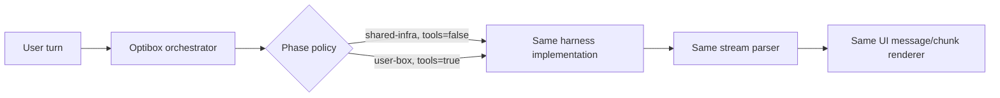
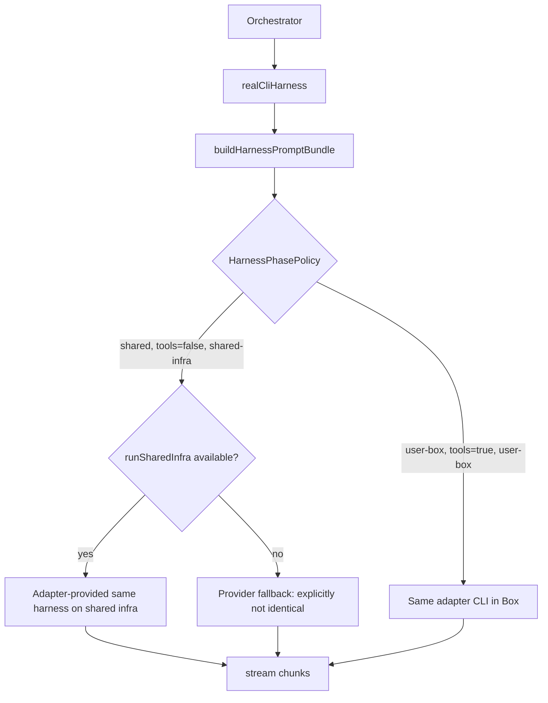
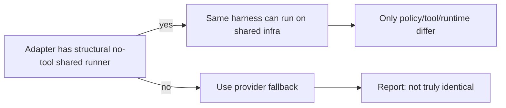
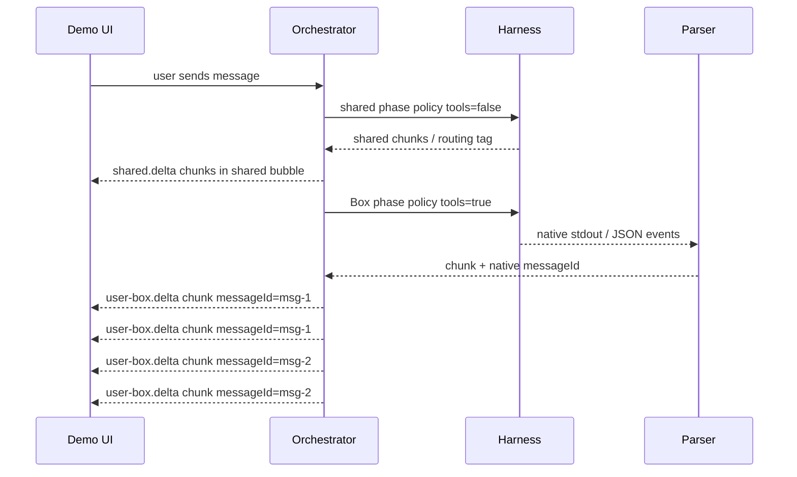

# Shared-vs-Box Harness Gap Report

Date: 2026-06-07

## User expectation

The expected architecture is **one harness implementation** with a phase/tool policy:

- same harness code path
- same prompt envelope shape
- same streaming parser/event path
- phase parameter changes only:
  - system/developer prompt injected by the framework
  - tools allowed vs denied
  - runtime location (`shared-infra` vs `user-box`)
  - harness-specific exposed tool set



## What was different before this PR

The previous `realCliHarness()` adapter had two meaningfully different paths:

```mermaid
flowchart TD
    O[Orchestrator] --> Shared[shared(ctx)]
    O --> Box[userBox(ctx)]
    Shared --> API[providerClient streamSharedAnswer direct LLM API]
    API --> SharedPrompt[shared-only prompt: latest-user-message]
    Box --> CLI[external harness CLI inside Box]
    CLI --> BoxPrompt[user-box prompt: latest-user-request + instruction file]
    CLI --> Parser[Box stdout JSON/raw parser]
```

Concrete differences:

| Area | Shared path before | Box path before | Why it was a gap |
|---|---|---|---|
| Execution code | Direct provider API via `streamSharedAnswer()` | Developer CLI harness in Box via `capabilities.runHarness()` | Not the same harness implementation. |
| Prompt builder | `buildSharedSystem()` + ad-hoc user string | `buildUserBoxInstructions()` + `buildPrompt()` | Different envelope shape and latest-message tag. |
| Tool policy | Prompt says no tools + restricted framework capabilities | Prompt says tools allowed + Box capabilities | Tool policy was not represented as a single explicit phase parameter. |
| Stream parser | Provider SSE parser | Harness stdout JSON/raw parser | Message/chunk semantics could diverge. |
| UI message identity | Shared bubble keyed by turn | Box bubble keyed by turn; fixed in this PR with `messageId` | Multi-message Box output collapsed before the previous fix. |

## What is fixed now

This PR adds a phase-aware harness prompt/policy layer:

- `HarnessPhasePolicy` explicitly carries `phase`, `toolsAllowed`, and `runtime`.
- `buildHarnessPromptBundle()` builds the same prompt envelope shape for shared and Box phases.
- `buildHarnessInstructions()` injects different policy instructions into the same builder rather than using two unrelated prompt builders.
- `realCliHarness.shared()` can now use `runSharedInfra()` when an adapter supplies a structurally safe no-tool shared-infra runner.
- If an adapter does **not** supply `runSharedInfra()`, the code intentionally keeps the safer provider fallback and documents that this is not true harness identity.



## What still cannot be honestly made identical for every harness

For generic third-party agent CLIs (Claude Code, OpenCode, Codex, Pi, etc.), Optibox cannot safely assume that a local/shared-infra CLI invocation has a real structural no-tool mode. Some CLIs can read files or run commands unless invoked with harness-specific restrictions, and those restrictions are different per harness/version.

Therefore, **true identity is only safe when the adapter declares/provides `runSharedInfra()`**, proving the shared-infra runner has tools structurally disabled. Without that, using the same CLI on shared infra would be a security lie: a prompt saying “do not use tools” is not equivalent to framework-enforced tool denial.

The code now makes this explicit instead of pretending:



## Visual behavior after both fixes



Result: separate assistant messages stay separate, and each message streams internally by real native chunks.

## Coverage added

- Prompt/policy coverage proving shared and user-box phases use the same prompt bundle builder with only policy differences.
- Shared-infra runner coverage proving `realCliHarness.shared()` can run an adapter-provided shared-infra no-tool harness instead of the provider fallback.
- Existing streaming coverage remains: native Box message ids, progressive private chunks, and demo UI separate bubbles.
