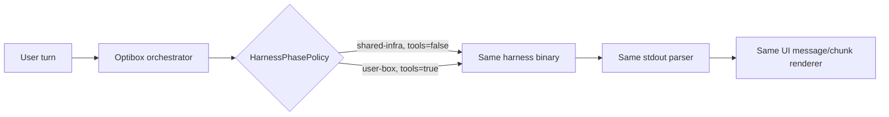
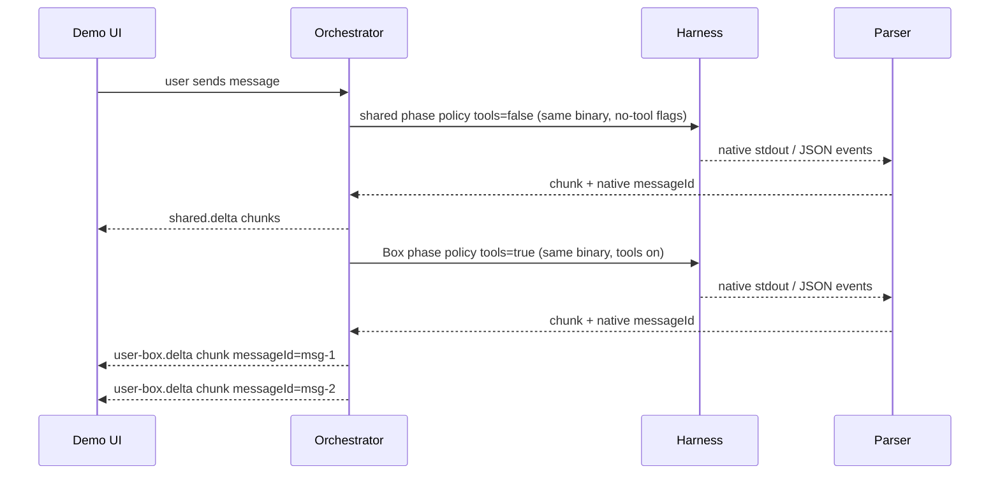

# Shared-vs-Box Harness Gap Report

Date: 2026-06-07

## Architecture: one harness, two surfaces, no fallback

There is **one harness implementation** per adapter. It runs on two surfaces with
a single difference between them: whether tools are structurally enabled.

- same harness binary / code path
- same prompt envelope (`buildHarnessPromptBundle`)
- same stdout stream parser (`parseHarnessOutput` / `parseHarnessJsonLine`)
- same chunk/message semantics (`messageId` + `messageIndex`)
- the **only** per-surface differences:
  - `toolsAllowed` (false on shared infra, true in the Box)
  - runtime location (`shared-infra` local process vs `user-box`)
  - the harness' own native tool set, exposed only when `toolsAllowed`

There is **no provider fallback** and **no separate shared LLM client**. The old
`src/providerClient.ts` (`streamSharedAnswer`) has been deleted. The shared
surface runs the exact same CLI harness as the Box — locally on shared infra —
with the harness' own structural no-tool flags engaged.

## How "the same code" is realized

| Concern | Shared infra | User Box |
|---|---|---|
| Runtime | `createSharedInfraCapabilities()` — `node:child_process` spawn of the real binary, stdout streamed via async-iterable | `createUserBoxCapabilities()` — same binary launched in the Box, stdout tailed from a log |
| Entry point | `realCliHarness.shared()` → `runHarnessTurn(spec, runtime, ctx, {toolsAllowed:false})` | `realCliHarness.userBox()` → `runHarnessTurn(spec, ctx.capabilities, ctx, {toolsAllowed:true})` |
| Prompt | `buildHarnessPromptBundle()` (identical) | `buildHarnessPromptBundle()` (identical) |
| Parser | `parseHarnessOutput` (identical) | `parseHarnessOutput` (identical) |
| Tools | structural no-tool flags from `spec.buildArgv({toolsAllowed:false})` / `spec.buildEnv(...)` | native tools via `spec.buildArgv({toolsAllowed:true})` |

`runHarnessTurn` is the single shared code path. `toolsAllowed` is the one
parameter that flows into `buildArgv`/`buildEnv` and changes the launched flags.
Multiple sessions run in parallel safely because each turn gets its own
`mktemp -d` workspace.

## Structural no-tool mechanism per harness (API evidence)

Each adapter passes the harness' own **framework-enforced** no-tool switch when
`toolsAllowed === false`. A prompt saying "don't use tools" is NOT used as the
guarantee — the guarantee is the harness' native mechanism below.

| Harness | `toolsAllowed:false` (shared) | `toolsAllowed:true` (Box) | Source |
|---|---|---|---|
| claude-agent-sdk | `--tools ""` (registers zero tools; init event reports `"tools":[]`) | `--dangerously-skip-permissions` | Claude Code CLI `--tools` option |
| openclaude | `--tools ""` (Claude Code fork, same option) | `--dangerously-skip-permissions` | OpenClaude `src/main.tsx` documents `--tools <tools...>`, `""` disables all |
| codex-sdk | `-s read-only` + `-c features.shell_tool=false` + `-c web_search="disabled"` | `--dangerously-bypass-approvals-and-sandbox` | Codex CLI config keys (verified accepted under `--strict-config`, codex-cli 0.137.0) |
| pi | `--no-tools` | (omitted) | Pi `packages/coding-agent/docs/usage.md`: `--no-tools, -nt Disable all tools` |
| codebase-daemon | `--no-tools` (daemon never reads `os.cpus`/cwd, defers machine requests) | (omitted) | Bundled `agentDaemon.ts` `--no-tools` contract |
| opencode | `OPENCODE_CONFIG_CONTENT={"permission":{"*":"deny"}}` | (no override) | OpenCode permission system (framework-enforced) |
| hermes | inherits OpenCode permission map (run via OpenCode/OpenRouter) | (no override) | Hermes reached through OpenCode provider |

Codex is the only harness without a single "zero tools" flag. It is handled
honestly with a documented combination of config keys rather than a fake flag —
this is structural (the model is never given the shell/web/write tools), not a
prompt request. All other harnesses expose a single explicit switch.

Every mechanism above is asserted in `test/orchestrator.test.ts`
("every adapter structurally disables tools when toolsAllowed is false"), which
calls each adapter's real `buildArgv`/`buildEnv` for both policies.

## Streaming behavior

Separate assistant messages stay separate (distinct `messageId`), and each
message streams internally by real native chunks. The shared and Box surfaces use
the identical parser, so message/chunk semantics cannot diverge.

## Coverage

- `realCliHarness runs the SAME harness binary on shared infra with tools structurally disabled (no provider fallback)` — proves `shared()` launches the real argv with the no-tool flag, not a provider API.
- `realCliHarness shared runtime must report shared-infra location` — guards the runtime contract.
- `no provider fallback module remains` — asserts `streamSharedAnswer` is gone and `src/providerClient.ts` is deleted.
- `every adapter structurally disables tools when toolsAllowed is false` — per-harness `buildArgv`/`buildEnv` evidence for all 7 adapters.
- `shared-infra runtime streams the same harness stdout with separate message ids` — proves the local spawn runtime streams progressive chunks with native message boundaries.
- `codebase daemon --no-tools never reads host machine facts` — proves the daemon's structural no-tool mode does not touch the host.
- Existing Box streaming coverage remains: native message ids, progressive private chunks, separate UI bubbles.
